<!-- 

  

 -->

  

## 👋 Hello there!

You can call me Apricot, Cosma, or *Apricosma!* 

I'm a full-stack developer hailing from Canada, and currently studying software engineering at [MITT](https://mitt.ca/). Expected graduation
is june-july 2023. I look forwards to learning improving my development skills every day to eventually enter the virtual reality industry.
I'm a long way from most of these right now, but I hope to get there in the future with hard work and passion.

My programming languages/platforms/frameworks are listed below, and I will be learning C#, React, .Net, SQL, LINQ, and ASP.Net throughout the year. I am 
planning on learning Python and machine learning on my own time as side projects, and I'm interested in building automation/bots for various applications.

You can find a link to my work-in-progress main website [-here-](https://apricosma.github.io)
  

My interests include, but aren't limited to:
- 👓 Virtual Reality
- 🤖 Artifical Intelligence
- 🧠 Machine Learning
- 🎨 Design 
- 🎮 Gaming
- 🎧 Electronic Music
   

  
Please find my current projects listed below, feedback is HIGHLY appreciated! (bully me)
<!---
Apricosma/Apricosma is a ✨ special ✨ repository because its `README.md` (this file) appears on your GitHub profile.
You can click the Preview link to take a look at your changes.
--->
